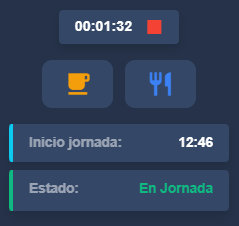

# Sistema de Fichaje de Jornada

Este sistema gestiona el control horario de los usuarios, incluyendo inicio y fin de jornada, pausas, y tiempo de comida.

## Funcionalidades Principales

### 1. Inicio y Fin de Jornada
- Al iniciar la jornada se registra el `started_at`.
- Al finalizar, se calcula el tiempo efectivo de trabajo restando pausas y comida.

### 2. Pausas
- Cada usuario puede pausar su jornada temporalmente.
- Campos usados:
  - `pause_started_at`: marca el inicio de la pausa.
  - `pause_total_seconds`: acumula el tiempo total de pausas.
- Al reanudar, se suma el tiempo pausado al total acumulado.

### 3. Comida
- Solo se permite un registro de comida por jornada.
- Comportamiento del botón:
  - Primer clic: inicia la comida (`meal_started_at`).
  - Segundo clic: termina la comida y se calcula la duración (`meal_total_seconds`).
  - Luego se desactiva permanentemente.
- Se muestra un cronómetro (`mealElapsed`) durante la comida.

### 4. Cronómetro Principal
- Muestra el tiempo efectivo transcurrido.
- Fórmula: `now() - started_at - pause_total_seconds - meal_total_seconds`.

### 5. Componentes Vue
- Botón de pausa: abre un modal de confirmación.
- Botón de comida: cambia de ícono dinámicamente (`restaurant`, `stop`, `check`).
- Todo el sistema es reactivo, sin necesidad de recargar la página.

### 6. Base de Datos (`time_records`)
- `id`
- `user_id`
- `started_at`
- `finished_at`
- `pause_started_at`
- `pause_total_seconds`
# Sistema de Fichaje de Jornada

Este sistema gestiona el control horario de los usuarios, incluyendo inicio y fin de jornada, pausas, y tiempo de comida.

## Funcionalidades Principales

### 1. Inicio y Fin de Jornada
- Al iniciar la jornada se registra el `started_at`.
- Al finalizar, se calcula el tiempo efectivo de trabajo restando pausas y comida.

### 2. Pausas
- Cada usuario puede pausar su jornada temporalmente.
- Campos usados:
  - `pause_started_at`: marca el inicio de la pausa.
  - `pause_total_seconds`: acumula el tiempo total de pausas.
- Al reanudar, se suma el tiempo pausado al total acumulado.

### 3. Comida
- Solo se permite un registro de comida por jornada.
- Comportamiento del botón:
  - Primer clic: inicia la comida (`meal_started_at`).
  - Segundo clic: termina la comida y se calcula la duración (`meal_total_seconds`).
  - Luego se desactiva permanentemente.
- Se muestra un cronómetro (`mealElapsed`) durante la comida.

### 4. Cronómetro Principal
- Muestra el tiempo efectivo transcurrido.
- Fórmula: `now() - started_at - pause_total_seconds - meal_total_seconds`.

### 5. Componentes Vue
- Botón de pausa: abre un modal de confirmación.
- Botón de comida: cambia de ícono dinámicamente (`restaurant`, `stop`, `check`).
- Todo el sistema es reactivo, sin necesidad de recargar la página.

### 6. Base de Datos (`time_records`)
- `id`
- `user_id`
- `started_at`
- `finished_at`
- `pause_started_at`
- `pause_total_seconds`
- `meal_started_at`
- `meal_total_seconds`
- `created_at`
- `updated_at`

## Vista del Módulo de Fichaje

A continuación se muestra una captura del sistema en funcionamiento:

- El cronómetro muestra el tiempo efectivo transcurrido.
- El botón de pausa (🟧) y comida (🍽️) cambian según el estado.
- Se visualiza el estado actual de la jornada.

## Notas Técnicas
- Todos los tiempos se almacenan en segundos.
- El cronómetro se actualiza automáticamente.
- Se evita el uso de `localStorage` y `window.location.reload()`.

## Estilos y Diseño
- Basado en Bootstrap 5.
- Diseño responsive con botones adaptativos.
- Tooltips informativos en botones y contadores.

---

© Sistema de Control Horario - 2025
- `meal_started_at`
- `meal_total_seconds`
- `created_at`
- `updated_at`

## Notas Técnicas
- Todos los tiempos se almacenan en segundos.
- El cronómetro se actualiza automáticamente.

## Estilos y Diseño
- Basado en Bootstrap 5.
- Diseño responsive con botones adaptativos.
- Tooltips informativos en botones y contadores.

---

© Sistema de Control Horario - 2025
