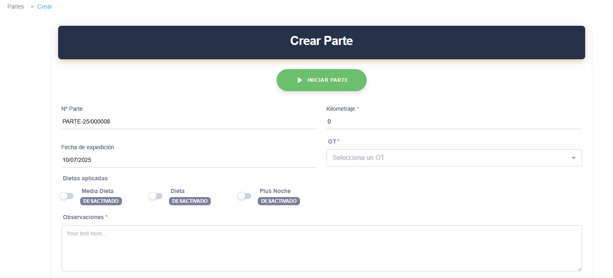
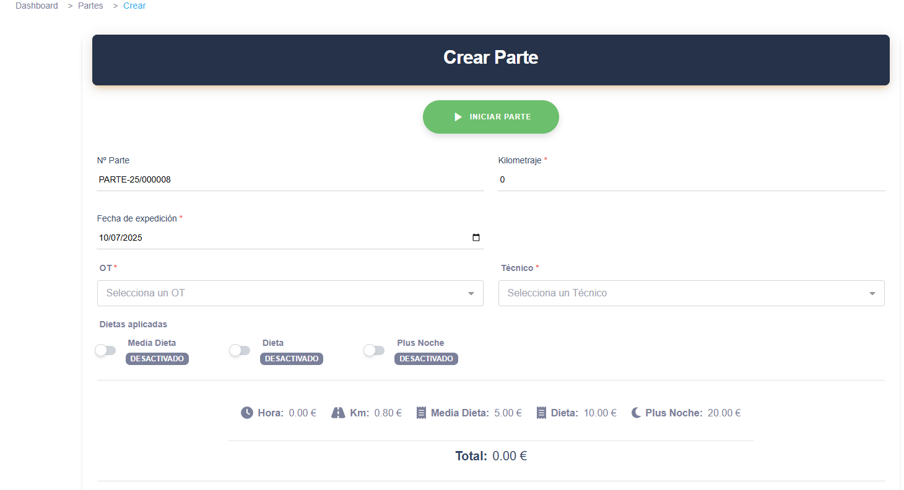
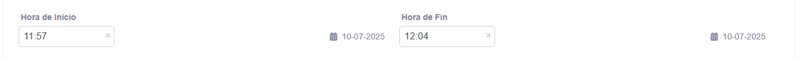
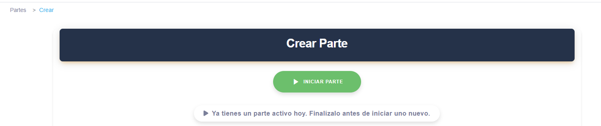
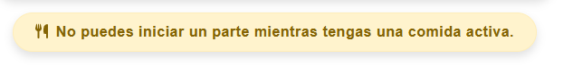
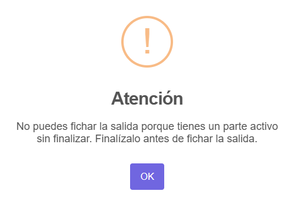

# 📑 PARTES — Documentación de funcionamiento

## 🚀 Descripción general

El sistema de **Partes** gestiona los registros de trabajos o tareas realizadas por técnicos y responsables. Cada parte tiene:

- `started_at`: fecha y hora de inicio
- `ended_at`: fecha y hora de finalización
- `time_seconds`: duración total en segundos

---

## 📝 Reglas de negocio

### ✅ 1) Creación de un Parte

- Cuando un técnico **crea un parte**, el sistema asigna automáticamente `started_at` con la hora actual.
- Si existe **otro parte activo** (sin `ended_at`) del mismo usuario en la fecha de hoy, el sistema **no permite crear otro parte**.
- Si hay una **comida activa**, tampoco se permite iniciar un nuevo parte.
- **Los responsables pueden crear partes en una fecha distinta a la actual** (partes retroactivos). Los empleados normales solo pueden crear partes para la fecha actual.




---

### ✅ 2) Edición de horas de un Parte

- **Los responsables** tienen permisos para modificar la **hora de inicio** y la **hora de fin** de cualquier parte registrado.



- **Los técnicos/empleados** no pueden modificar `started_at` ni `ended_at`; solo pueden cerrarlos de forma manual.

---

### ⚡ 3) Cierre automático de Partes

- Si el usuario olvida cerrar el parte, un **comando automático** se encarga de cerrarlo:
```bash
php artisan partes:cerrar-pendientes
```
O para todos:
```bash
php artisan schedule:run
```

- El comando busca partes del día actual (`fecha = hoy`) que no tengan `ended_at`.
- Les asigna:
  - `ended_at = now()`
  - `time_seconds = 1` (por política de control, para evitar divisiones por cero)

- Este comando se ejecuta **diariamente a las 23:55** mediante `schedule:run`.

---

### 🔒 4) Bloqueos y validaciones

- **No se puede iniciar más de un parte abierto por día por técnico.**

- **No se puede iniciar un parte si existe una comida activa.**

- **No se puede cerrar sesión** si el empleado tiene un parte activo sin cerrar.

- Todo parte debe cerrarse correctamente para que `time_seconds` refleje el tiempo real trabajado.

---

## 🗃️ Comandos programados

```bash
# Manual:
php artisan partes:cerrar-pendientes

# Automático:
Programado en `routes/console.php`:
  Schedule::command('partes:cerrar-pendientes')->dailyAt('23:55');
```

---

## 📈 Buenas prácticas

- Recomienda a los técnicos **cerrar sus partes manualmente**.
- Revisa periódicamente los partes autocerrados (`time_seconds = 1`) como indicador de posibles olvidos.
- Monitorea logs de `schedule:run` para validar la ejecución correcta de cierres automáticos.

---

## ⚙️ Archivos clave

- `app/Console/Commands/PartesCerrarPendientes.php`: lógica de autocierre.
- `routes/console.php`: programación del cron diario.
- Controladores y formularios de creación: validaciones de parte y comida activa.
- Middleware o validación de cierre de sesión con parte activo.

---

✅ **Última actualización:** Julio 2025
