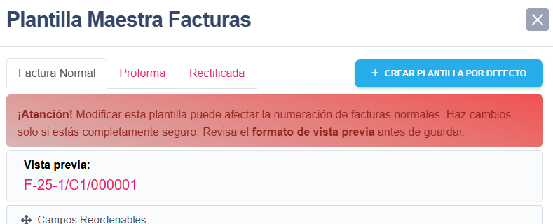
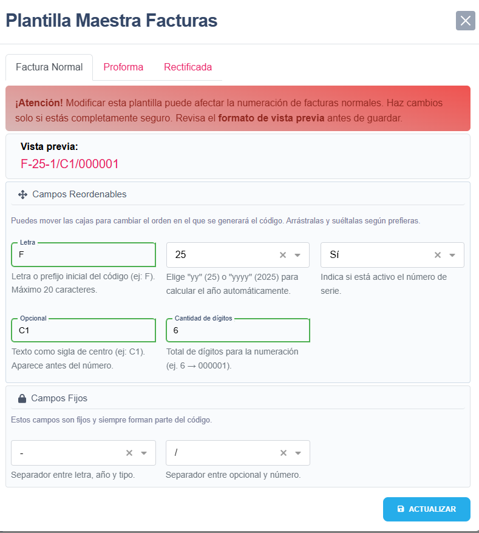

# 📄 Instrucciones para la tabla `plantillas_maestras`

## 1. Descripción

La tabla `plantillas_maestras` almacena la configuración base para generar códigos automáticos de documentos como facturas, presupuestos, etc.

Cada registro define cómo debe generarse un número de documento, con campos como:

- Tipo de documento (`tipo`)
- Letra de prefijo (`letra`)
- Serie (`serie`)
- Año (`year`)
- Cantidad de dígitos (`cantidad`)
- Separadores (`simbolo_1`, `simbolo_2`)
- Parte opcional (`opcional`)
- Número de serie activo (`numeroSerieActivo`)
- Orden de los campos (`orden`)
- Usuario que actualizó (`updated_by`)

---

## 2. ¿Qué hacer después de migrar?

✅ **Obligatorio**: Ejecutar el seeder para insertar las plantillas iniciales:

```bash
php artisan db:seed --class=PlantillaMaestraSeeder
```

🔁 **Alternativa visual**: Si no puedes ejecutar el seeder manualmente, puedes hacerlo desde la app:

### 📌 Zona privada de usuario (solo administradores)

En la ruta `/my_zone`, verás un botón llamado:

> **Crear Plantilla por Defecto**

Al pulsarlo:

- Se insertarán automáticamente las 5 plantillas básicas.
- El botón desaparecerá tras crearse correctamente.




---

## 3. ¿Por qué es importante ejecutar el seeder o la alternativa visual?

- El sistema **no podrá generar códigos** si no existen plantillas.
- Todas las numeraciones (`Factura`, `Presupuesto`, etc.) dependen directamente de esta tabla.
- El helper `CodigoDocumentoHelper` construye el número usando estas plantillas.

---

## 4. Nuevas funcionalidades disponibles

### 🔁 Orden personalizado de los campos (`orden`)

Cada plantilla ahora incluye un campo `orden` (tipo JSON), que permite definir de forma flexible cómo se construye el número.
Ejemplo:

Por defecto:
```json
["letra","year","numeroSerieActivo","opcional","cantidad"]
```

Esto permite construir códigos como:

```
F-25-1/C1/000001
```

o

```json
["cantidad", "letra", "year", "numeroSerieActivo", "opcional"]
```

```
000001-F-25-1/C1
```

### 🖱 Interfaz visual con arrastrar y soltar

En la vista de configuración de plantillas, ahora puedes:

- Reordenar los campos usando **drag & drop** (arrastrar y soltar).
- Ver en tiempo real cómo cambiará el código en la **vista previa**.
- Modificar los símbolos (`-`, `/`) y campos fijos con una interfaz clara.



---

## 5. Datos iniciales del Seeder (`PlantillaMaestraSeeder`)

El seeder crea automáticamente cinco plantillas base para el tipo `Factura`, cada una asociada a una serie específica.
Todas comparten el mismo orden por defecto:

```php
['letra', 'year', 'numeroSerieActivo', 'opcional', 'cantidad']
```

| Tipo     | Letra | Serie | Año  | Cantidad | Simbolo 1 | Simbolo 2 | Opcional | Numero Serie Activo  | Orden                                                          |
|----------|-------|-------|------|----------|-----------|-----------|----------|----------------------|----------------------------------------------------------------|
| Factura  | F     | 1     | yy   | 6        | -         | /         | C1       | true                 | ['letra', 'year', 'numeroSerieActivo', 'opcional', 'cantidad'] |
| Factura  | P     | 7     | yy   | 6        | -         | /         | C1       | true                 | ['letra', 'year', 'numeroSerieActivo', 'opcional', 'cantidad'] |
| Factura  | R     | 2     | yy   | 6        | -         | /         | C1       | true                 | ['letra', 'year', 'numeroSerieActivo', 'opcional', 'cantidad'] |
| Factura  | F     | 5     | yy   | 6        | -         | /         | C1       | true                 | ['letra', 'year', 'numeroSerieActivo', 'opcional', 'cantidad'] |
| Factura  | F     | 11    | yy   | 6        | -         | /         | C1       | true                 | ['letra', 'year', 'numeroSerieActivo', 'opcional', 'cantidad'] |

> **Nota:** Estas plantillas se insertan automáticamente al ejecutar el seeder.

---

## 6. Información adicional

- El helper `CodigoDocumentoHelper` genera los códigos según la plantilla.
- Si cambias una plantilla, afectará la generación de los siguientes documentos.
- Puedes usar múltiples combinaciones gracias al campo `orden`, sin alterar el backend.

---

© Plantilla Maestra - 2025
